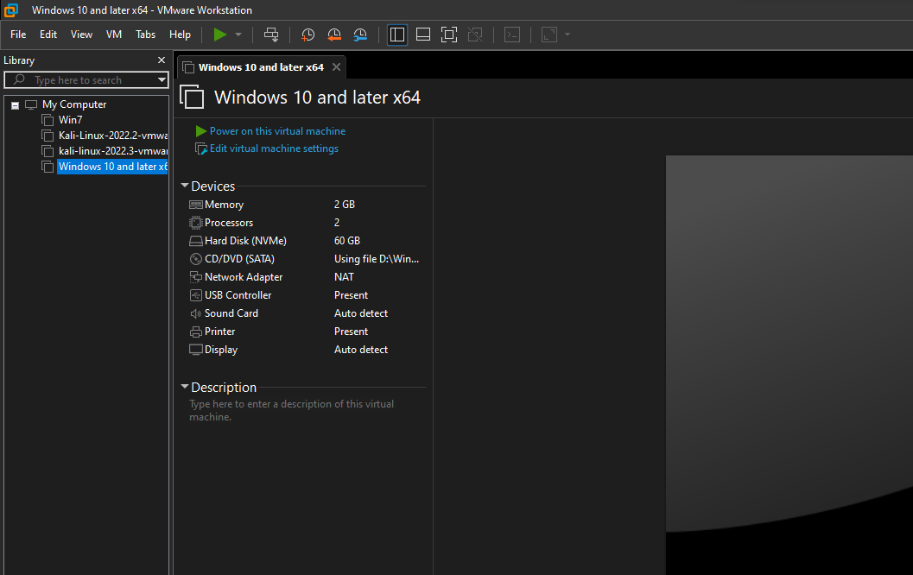
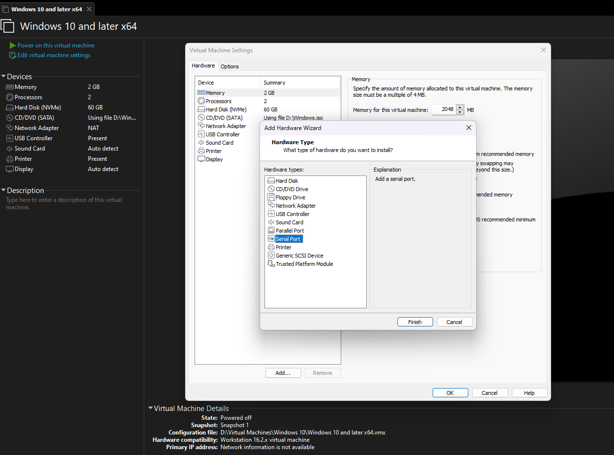
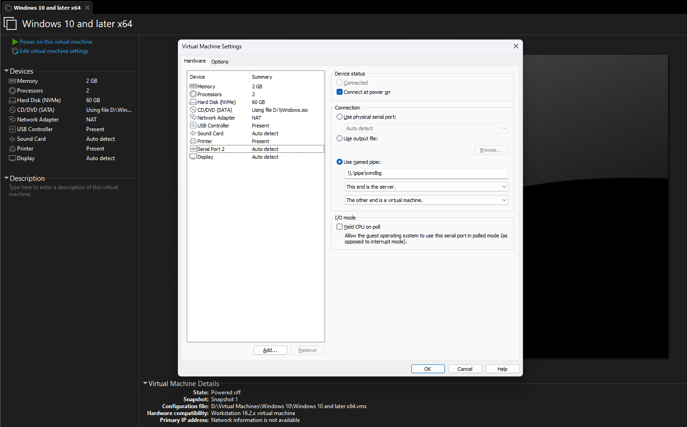
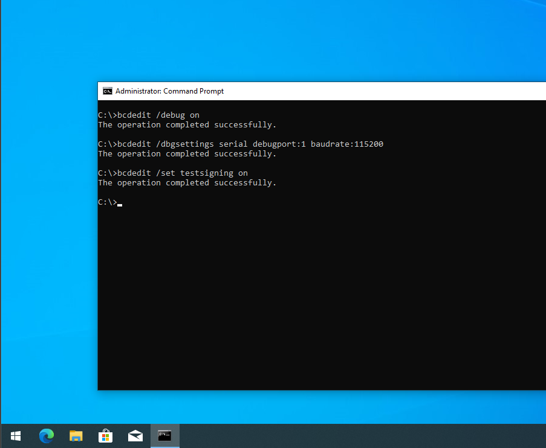
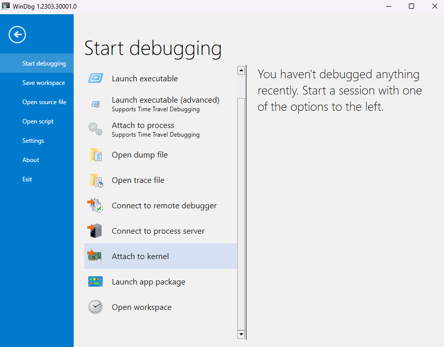
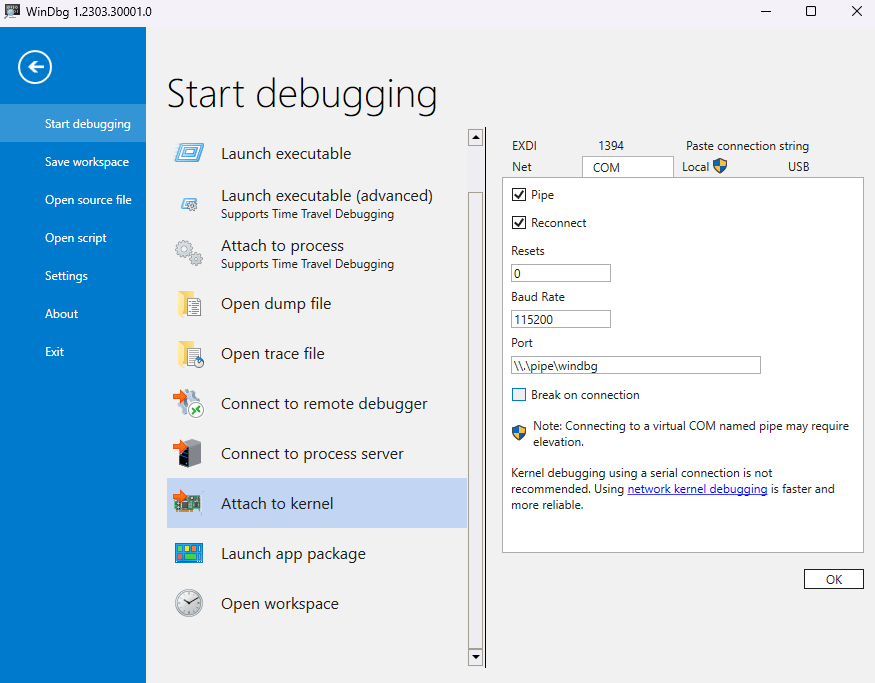
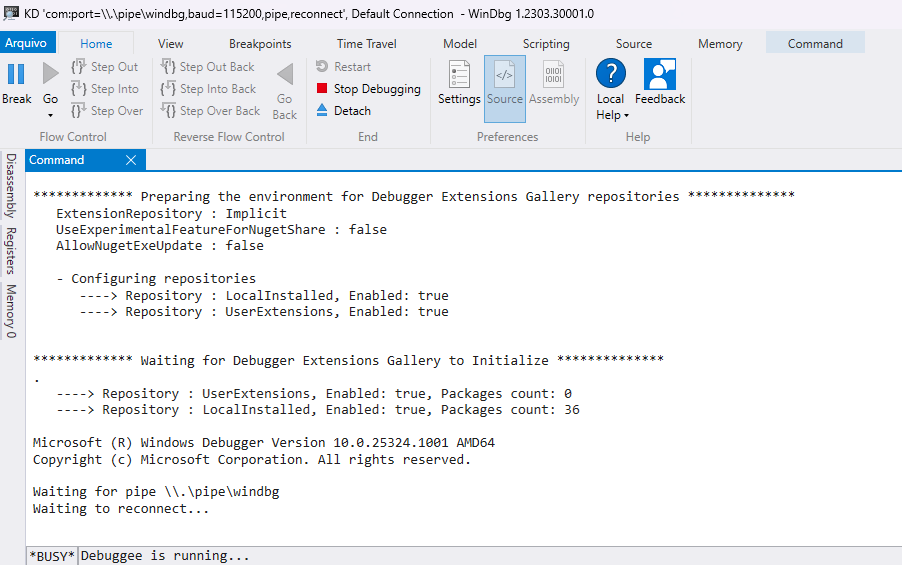
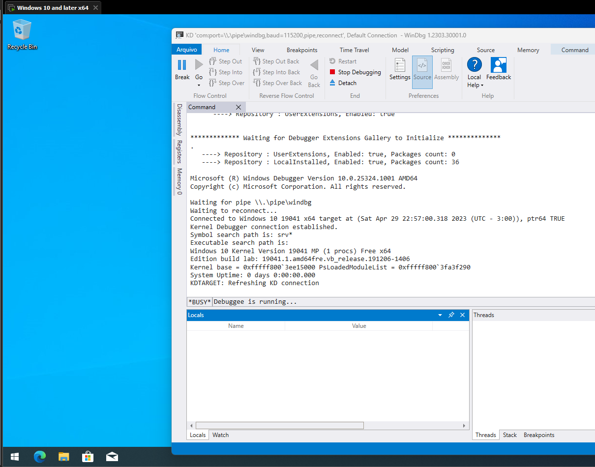

# How to set up a VMware lab to debug Kernel Driver with Windbg

For this tutorial, you need a physical Windows host computer responsible for running Windbg and another Windows host running virtually in VMWare.

Windbg download:

[https://learn.microsoft.com/en-us/windows-hardware/drivers/debugger/debugger-download-tools](https://learn.microsoft.com/en-us/windows-hardware/drivers/debugger/debugger-download-tools)

Windows iso download:

[https://www.microsoft.com/en-us/software-download/windows10](https://www.microsoft.com/en-us/software-download/windows10)

# Configuring Virtual Machine

1. Open “Edit virtual machine setting” option



1. Add a Serial Port



1. In the details of the serial port configuration select “use named pipe”, define a name of your choice (**\\.\pipe\windbg** in my case) and the checkbox “Yield CPU on poll” in I/O Mode:



This serial [COM](https://learn.microsoft.com/en-us/windows-hardware/drivers/serports/configuration-of-com-ports) port will be used to communicate over named pipe with Windbg running on the physical machine

1. Power the VM on, open an elevated Command Prompt window and enter the following commands:

```powershell
C:\>bcdedit /debug on
The operation completed successfully.

C:\>bcdedit /dbgsettings serial debugport:2 baudrate:115200
The operation completed successfully.

C:\>bcdedit /set testsigning on
The operation completed successfully.
```

**Note**: The *debugport *****number should correspond to the COM port number we configured with the named pipe (in my case 2 the same as the COM port)



[BCDEdit](https://learn.microsoft.com/en-us/windows-server/administration/windows-commands/bcdedit) is a command-line tool for managing BCD stores. It can be used for a variety of purposes, including creating new stores, modifying existing stores, adding boot menu parameters, and so on

****Parameters that Control Debugging****

| Parameter | Description |
| --- | --- |
| /dbgsettings | Specifies or displays the global debugger settings for the system. This command does not enable or disable the kernel debugger; use the /debug option for that purpose. To set an individual global debugger setting, use the bcdedit /set <dbgsettings> <type> <value> command. |
| /debug | Enables or disables the kernel debugger for a specified boot entry. |
1. Reboot the VM.

# Configuring Windbg

1. On the physical machine, open Windbg, select “*Attach to kernel*”



1. In the COM tab check the “*Pipe*” and “*Reconnect*” checkboxes. After that, in the Port field, use the same named pipe as defined in the virtual machine's serial port configuration (**\\.\pipe\windbg**)



When finishing configuration, Windbg is able to receive new connections:



# Virtual machine debugging

Keep Windbg open and start the virtual machine by doing this Windgb will receive the message “*Kernel Debugger connection estabilished*”:



Well done;

References:

- [https://training.zeropointsecurity.co.uk/courses/offensive-driver-development](https://training.zeropointsecurity.co.uk/courses/offensive-driver-development)
- [https://learn.microsoft.com/en-us/windows-hardware/drivers/debugger/attaching-to-a-virtual-machine--kernel-mode-](https://learn.microsoft.com/en-us/windows-hardware/drivers/debugger/attaching-to-a-virtual-machine--kernel-mode-)
